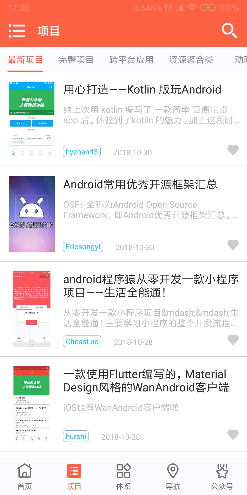
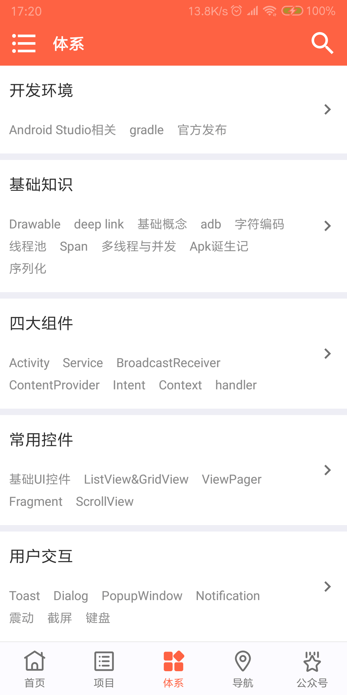
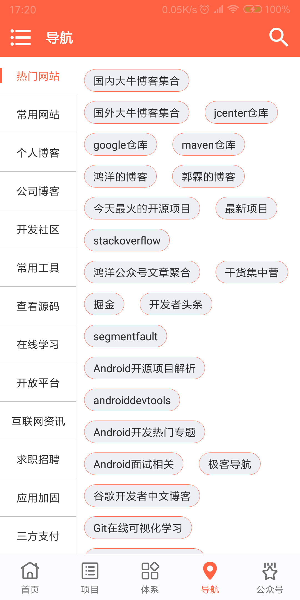
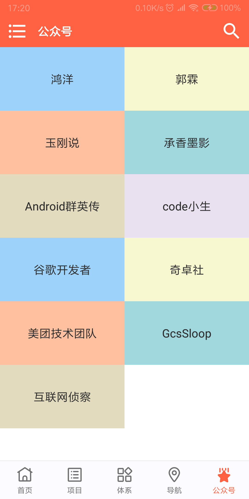
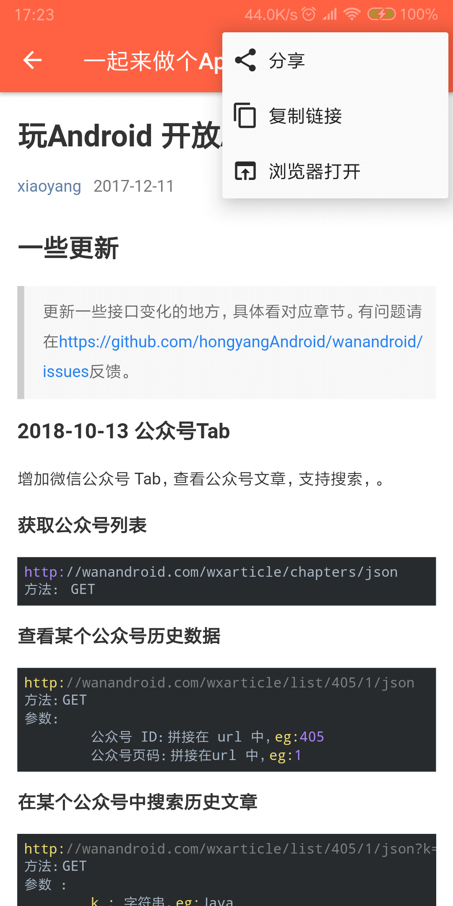
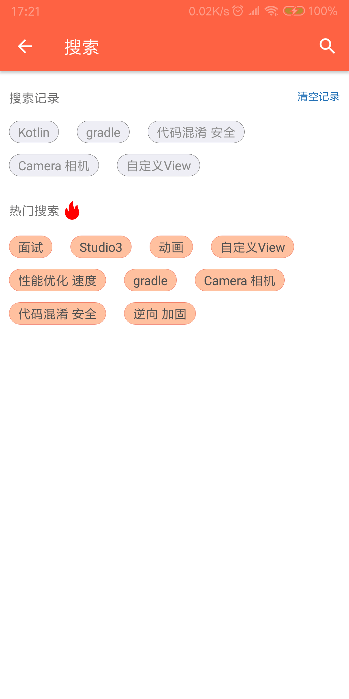
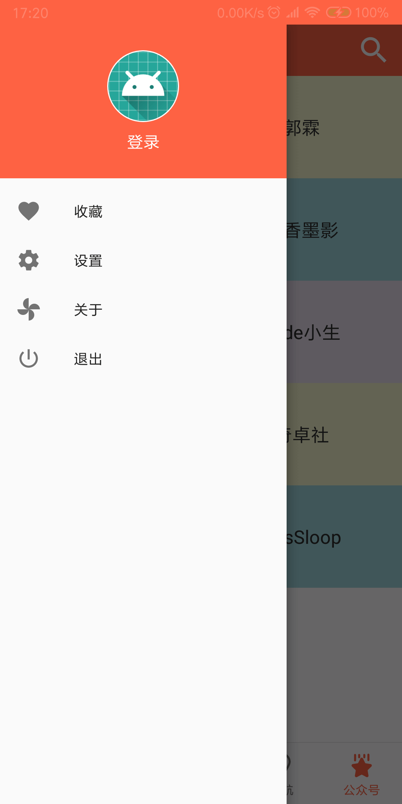
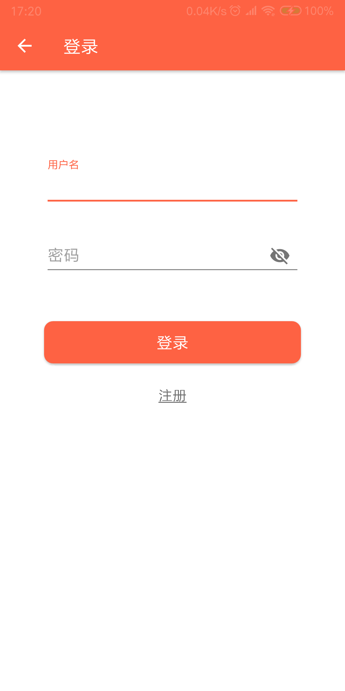
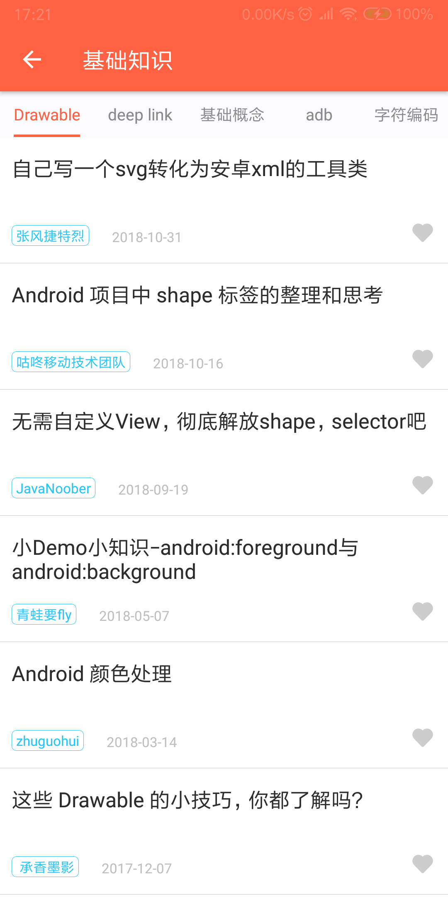
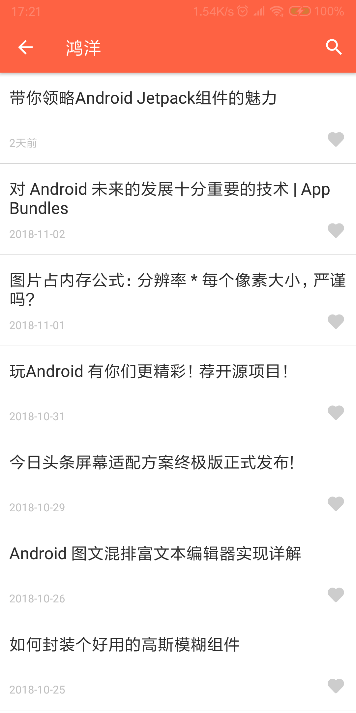

# WanAndroid

### 说明

**一个Kotlin版的玩Android App，基于鸿洋大神的[玩Android开放API](http://www.wanandroid.com/blog/show/2)开发，旨在学习 Kotlin，功能逐步完善中…**

扫码下载体验：

### 预览
|||||
|---|---|---|---|
|||||
|||||

### 已有功能
- [X] 首页banner、文章列表
- [X] 项目分类
- [X] 知识体系
- [X] 网站导航
- [X] 公众号
- [X] 全局搜索、公众号内搜索
- [X] 注册、登录
- [X] 收藏

### 使用的开源库
* [okhttp](https://github.com/square/okhttp)
* [retrofit](https://github.com/square/retrofit)
* [RxJava](https://github.com/ReactiveX/RxJava)
* [glide](https://github.com/bumptech/glide)
* [EventBus](https://github.com/greenrobot/EventBus)
* [LitePal](https://github.com/LitePalFramework/LitePal)
* [flexbox-layout](https://github.com/google/flexbox-layout)
* [banner](https://github.com/youth5201314/banner)
* [AVLoadingIndicatorView](https://github.com/81813780/AVLoadingIndicatorView)
* [NiceDialog](https://github.com/SheHuan/NiceDialog)
* [NiceImageView](https://github.com/SheHuan/NiceImageView)
* [RecyclerViewAdapter](https://github.com/SheHuan/RecyclerViewAdapter)
* [StatusView](https://github.com/SheHuan/StatusView)